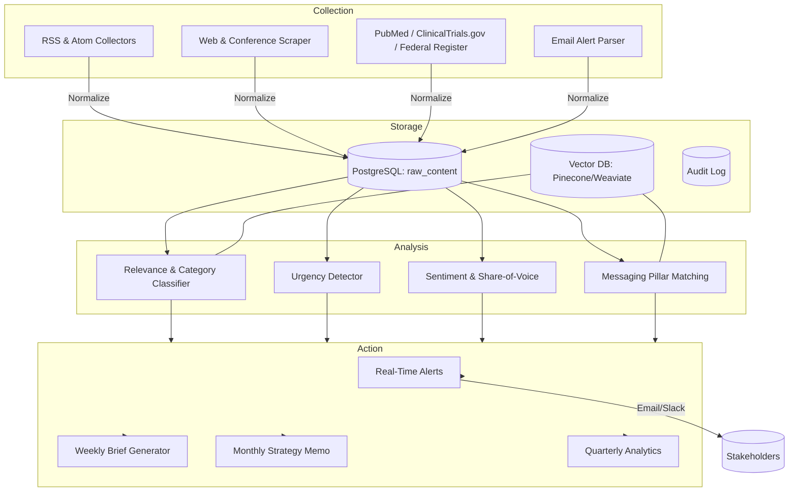

# System Architecture

## Operational Workflow
1. **Collection:** Scheduled jobs pull from RSS/APIs hourly; web/conference scrapes daily; email inbox polled every 10 minutes. Content normalized into `raw_content` table with full provenance.
2. **Analysis:** Batch and streaming processors enrich records using LLM prompts with grounding to the vector index built from Dr. Badhwar’s publications, prior interviews, and approved messaging. Results stored in `analysis_enriched` table.
3. **Actioning:** Alert engine applies relevance and urgency thresholds. Quiet items queue for weekly processing; critical triggers push to email and Slack. Brief generators assemble AI-drafted outputs flagged for human review before release.
4. **Audit:** Every AI output and subsequent human edit is logged with timestamps and approvers to maintain traceability.

## Deployment Shape
- **Compute:** Dockerized workers (collection, analysis, action) orchestrated via cron or n8n. PostgreSQL + vector DB managed service recommended.
- **Secrets:** API keys provided via environment variables or Vault. No secrets committed.
- **Observability:** Structured JSON logs, heartbeat checks for collectors, and alerting on ingest gaps (>90 minutes) or failed jobs.
- **Human-in-loop:** Admin dashboard or simple Flask/Next.js UI for reviewing alerts, approving drafts, and exporting briefs to PDF.
